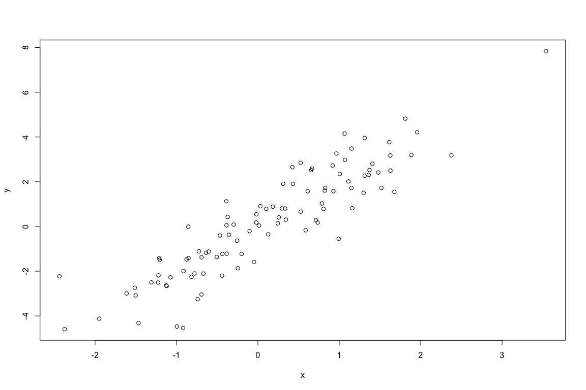
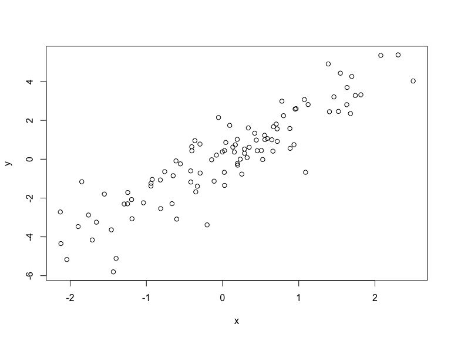

This is a package that allows me to round results neatly.


For example:


```r
x <- rnorm(100)
y <- 2*x + rnorm(100)
myround(cor(x, y), 2)
```

```
## [1] "0.91"
```

This is a simple example of a Markdown document.

Use a blank link between paragraphs.
You can use a bit of **bold** or _italics_. Use backticks to indicate
`code` that will be rendered in monospace.

Here's a list:

- an item in the list
- another item
- yet another item

It'll figure out numbered lists, too:

1. First item
2. Second item

And it's easy to create links, like to
the [Markdown](https://daringfireball.net/projects/markdown/)
page.

You can include blocks of code using three backticks:

<!-- -->

The initial line in a code chunk may include various options. For example, echo=FALSE indicates that the code will not be shown in the final document (though any results/output would still be displayed).


```
## [1] 0.8857847
```

You use results='hide' to hide the results/output (but here the code would still be displayed).


You use include=FALSE to have the chunk evaluated, but neither the code nor its output displayed.


If I’m writing a report for a collaborator, I’ll often use include=FALSE to suppress all of the code and largely just include figures.

For figures, you’ll want to use options like fig.width and fig.height. For example:

<!-- -->

That's the end of my markdown test.


