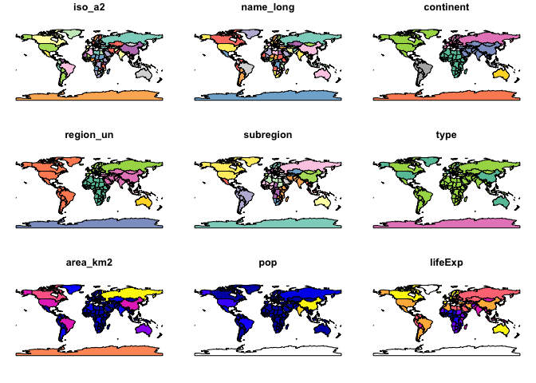
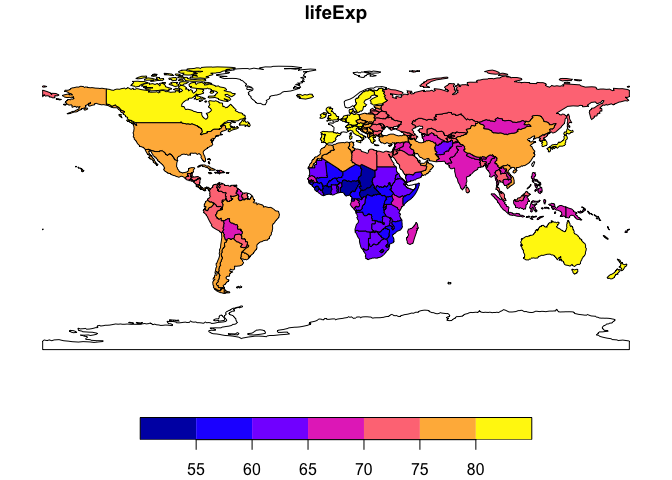

This is an opening sentence to describe my R workflow.


```r
#Here is some sample code from Geocomputation with R

#Chapter 2: Geographic Data in R
library(sf)          # classes and functions for vector data
```

```
## Warning: package 'sf' was built under R version 3.5.2
```

```
## Linking to GEOS 3.6.1, GDAL 2.1.3, PROJ 4.9.3
```

```r
library(raster)      # classes and functions for raster data
```

```
## Warning: package 'raster' was built under R version 3.5.2
```

```
## Loading required package: sp
```

```r
library(spData)        # load geographic data
```

```
## Warning: package 'spData' was built under R version 3.5.2
```

```r
library(spDataLarge)   # load larger geographic data

#install.packages("spDataLarge", repos = "https://nowosad.github.io/drat/", type = "source")

#setwd("/Users/noeljohnson/Dropbox/Research/R Templates/SpatialAnalysis")

names(world)
```

```
##  [1] "iso_a2"    "name_long" "continent" "region_un" "subregion"
##  [6] "type"      "area_km2"  "pop"       "lifeExp"   "gdpPercap"
## [11] "geom"
```

```r
plot(world)
```

```
## Warning: plotting the first 9 out of 10 attributes; use max.plot = 10 to
## plot all
```

<!-- -->

```r
summary(world["lifeExp"])
```

```
##     lifeExp                 geom    
##  Min.   :50.62   MULTIPOLYGON :177  
##  1st Qu.:64.96   epsg:4326    :  0  
##  Median :72.87   +proj=long...:  0  
##  Mean   :70.85                      
##  3rd Qu.:76.78                      
##  Max.   :83.59                      
##  NA's   :10
```

```r
plot(world["lifeExp"])
```

<!-- -->

That's the end of my markdown test.


