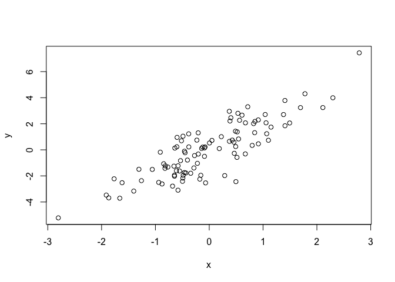

This is a simple example of a Markdown document.

Use a blank link between paragraphs.
You can use a bit of **bold** or _italics_. Use backticks to indicate
`code` that will be rendered in monospace.

Here's a list:

- an item in the list
- another item
- yet another item

It'll figure out numbered lists, too:

1. First item
2. Second item

And it's easy to create links, like to
the [Markdown](https://daringfireball.net/projects/markdown/)
page.

You can include blocks of code using three backticks:


```r
x <- rnorm(100)
y <- 2*x + rnorm(100)
plot(x, y)
```

<!-- -->

That's the end of my markdown test.


